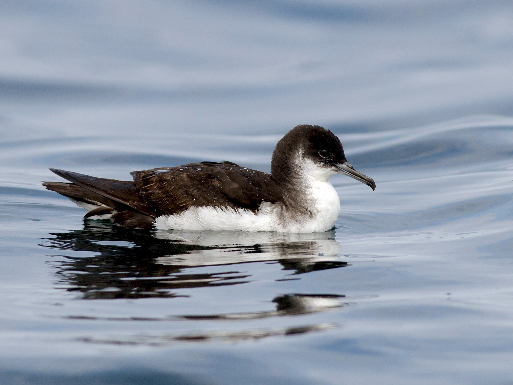

[Data analysis of Manx Shearwater foraging behavior.]{style="color:purple"}



```{r setup, warning = FALSE, message = FALSE, echo = FALSE}
library(tidyverse)
library(gtsummary)
library(gt)
library(palmerpenguins)
library(flextable)
library(hexbin)
library(knitr)
```

```{r data import, message=FALSE, echo=FALSE, warning=FALSE}
Manx <- read_csv("../Data/MASH2015-2019_daily-foraging-data.csv")
Manx <- filter(Manx, end_mass + prop_flight + prop_rest != "NA")
```

## Data Summary

Summary table of data.

```{r basic summary, echo = FALSE}
table1 <- 
  Manx %>%
  tbl_summary(by=phase,
              missing = "no", #gets rid of pesky NAs
              include = c(start_mass, end_mass, prop_rest))

table1
```

```{r set builtin theme}
theme_gtsummary_mean_sd(set_theme = TRUE)
#Sets default summary statistics to mean and standard deviation in tbl_summary()
#Sets default continuous tests in add_p() to t-test and ANOVA
```

## T-Test

T-test results and Boxplot.

```{r t-test table, message=FALSE, warning=FALSE, echo=FALSE}
#gtsummary works best with datasets without NA values, otherwise it attempts to report # of NAs (annoying)

table_ttest <- Manx %>%
  filter(phase == "commute" ) %>%
  select(sex, start_mass, prop_flight, prop_forage, prop_rest, end_mass) %>% 
  #retain specific variables used in summaries rather than using all
  tbl_summary(
    by = sex,
    missing = "no",
    # remove missing values (NAs). "ifany" will include a missing values row in table.
    digits = all_continuous() ~ 1,
    #number of displayed digits for continuous variables
    label = list(
      start_mass ~ "Starting Mass (g)",
      prop_flight ~ "prop_flight",
      prop_forage ~ "prop_forage",
      prop_rest ~ "prop_rest",
      end_mass ~ "Ending Mass(g)"
    ),
    statistic = list(all_continuous() ~ "{mean} ({sd})", #can use any character for parentheses
                     all_categorical() ~ "{n}") #count obs. for categorical variables
  ) %>% 
  add_p(pvalue_fun = ~ style_pvalue(.x, digits = 2)) %>% #number of digits displayed for p-values
  modify_caption("Table 1. *Manx Shearwater* Foraging Data") %>%
  modify_header(
    update = list(
      label ~ '',
      stat_1 ~ '**M**', #is markdown **bold** formatting
      stat_2 ~ '**F**',
      p.value ~ '**P-value**')
  )

#show_header_names(table_ttest) 
#lets you preview code for changing header names and formatting  
                
table_ttest
```

```{r Save T-Test table}
table_ttest %>%
  as_flex_table() %>%
  flextable::save_as_docx(path = "../Tables/Ttest_flextable.docx")
```

```{r t-test box, echo=FALSE}

Manxbox <- ggplot(Manx, aes(x = sex, y = prop_flight,
                                color = phase)) +
  geom_boxplot() +
  theme_bw()

Manxbox
ggsave("Figures/Manxbox.png")
```

## Anova

Anova results and bar graph.

```{r Anova Table, echo = FALSE}
#this function works best with datasets without NA values

table_Anova <- Manx %>%
  select(phase, sex, start_mass, end_mass) %>% #retain variables used in summaries
  filter(phase %in% c("forage", "commute")) %>%
  tbl_summary(
    by = phase,
    #every species gets its own column and summary stats
    missing = "no",
    # remove missing values (NAs). "ifany" will include a missing values row in table.
    digits = all_continuous() ~ 1,
    #number of displayed digits for continuous variables
    label = list(
      start_mass ~ "Starting Mass (g)",
      #change column labels in table
      end_mass ~ "Ending Mass (g)",
      sex ~ "Sex"
    ),
    statistic = list(all_continuous() ~ "{mean} ({sd})", #can use any character for parentheses
                     all_categorical() ~ "{n}")
  ) %>% #count obs. for categorical variables
  #add_p(snout_vent_length_mm ~ "aov") %>% CANT FIGURE OUT HOW TO FORCE ANOVA
  add_p(pvalue_fun = ~ style_pvalue(.x, digits = 2)) %>% #number of digits displayed for p-values
  modify_caption("Table 2. Foraging phase and mass") %>%
  #modify_header(update = all_stat_cols() ~ "**{level}**") %>%  #headers to only contain species name
  #modify_footnote(all_stat_cols() ~ NA) %>% #squashes superscripts for the groups
  modify_footnote(everything() ~ NA) %>%
  modify_header(
    update = list(
      label ~ '',
      stat_1 ~ '**Foraging**',
      stat_2 ~ '**Commuting**',
      p.value ~ '**P-value**'
    )
  )

#show_header_names(table_Draco1) 
#lets you preview code for changing header names and formatting  
                
table_Anova
```

```{r Save ANOVA, echo=FALSE}
table_Anova %>%
  as_flex_table() %>%
  flextable::save_as_docx(path = "../Tables/Anova_flextable.docx")
```

```{r summary, echo=FALSE}
sumManx <- Manx %>%
  group_by(sex, phase) %>%
  summarise(
    meanmass = mean(end_mass),
    semass = sd(end_mass))

```

```{r bar plot, echo=FALSE}
ManxBar <- ggplot(sumManx, aes(x = phase, y = meanmass, 
                     color = sex, fill = sex)) +
  geom_bar(stat = "identity", position = "dodge") +
  geom_errorbar(aes(ymin = meanmass - semass,
                    ymax = meanmass + semass), width =0.4, position = position_dodge(width = 0.9)) +
  scale_fill_manual(values = c(F = "red", M = "blue")) + 
  theme_bw() 
ManxBar
ggsave("Figures/ManxBar.png")
```

## ANCOVA

ANCOVA results and line graph.

```{r data import and filter, message=FALSE, warning=FALSE, echo=FALSE}
Foraging <- Manx %>%
  filter(phase == "forage") #get one species to work with
ANCOVATable <- Foraging %>% 
  select(start_mass, prop_flight, prop_forage, prop_rest, sex)%>%
  tbl_summary(by=sex, 
              #statistic=list(all_continuous()~"{mean}({sd})"), 
              #missing="no",
              digits = all_continuous() ~ 1,
              include=c(prop_flight, prop_forage, prop_rest),
              )%>%
  add_difference(adj.vars=c(start_mass)) #this one line turns it from an ANOVA to an ANCOVA table (magic)
  #add_p(pvalue_fun = ~ style_pvalue(.x, digits = 2))   #cannot get to work; throws error

ANCOVATable
```

```{r Save Ancova table, echo=FALSE}
ANCOVATable %>%
  as_flex_table() %>%
  flextable::save_as_docx(path = "../Tables/ANCOVA_flextable.docx")
```

```{r see if gtsummary results match a generic GLM result, echo=FALSE}
model_1 <- lm(prop_flight ~ start_mass + sex, data=Foraging)
#notice this is a parallel slopes model (How can you tell?)
summary(model_1)
```

```{r ANCOVA plot, message=FALSE, echo= FALSE, warning=FALSE}
#make ANCOVA from a fit model; one of many ways to do this.
model_1_fortified <- fortify(model_1)
ggplot(model_1) +
  geom_point(aes(x = start_mass, y = prop_flight, color = sex)) +
  geom_line(aes(x = start_mass, y = .fitted, color = sex)) +
  geom_vline(xintercept=mean(Foraging$start_mass), linetype='dashed', color='blue', size=0.5) +
  theme_gray() 
ggsave("Figures/Flight_mass.png")
```
